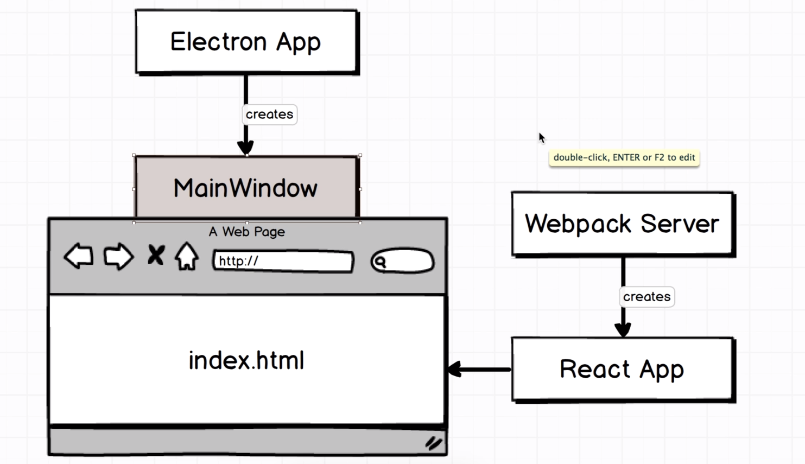
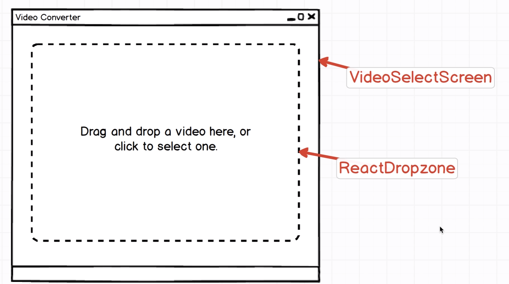
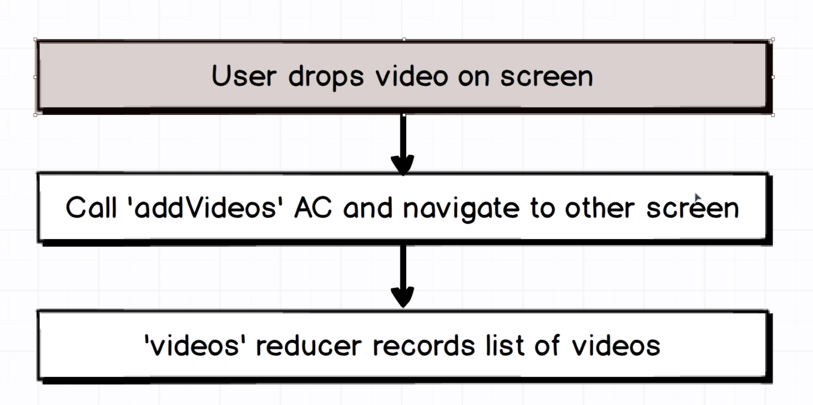
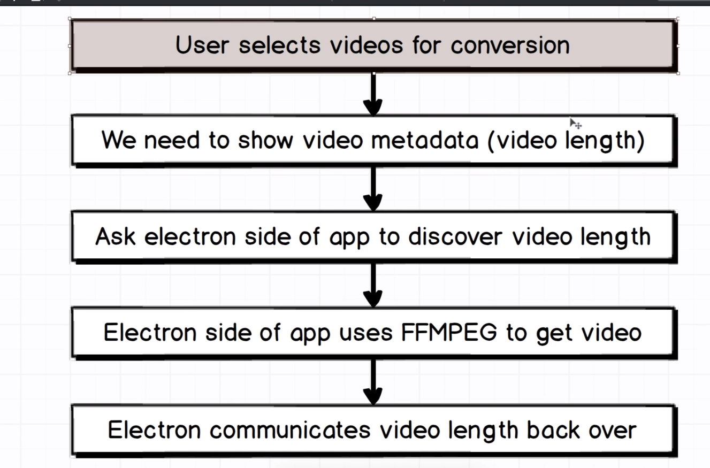
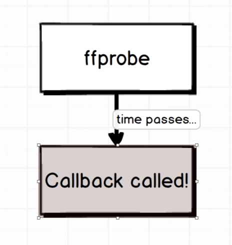
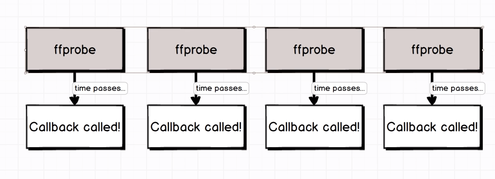
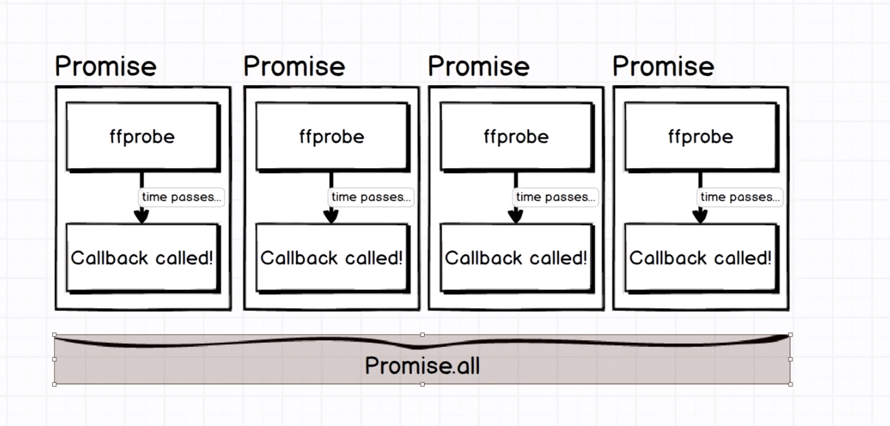

# Video Converter

### Getting started

`npm install --legacy-peer-deps`

Start dev server:

`npm start`

In a new terminal window:

`npm run electron`

## App Architecture



### React Side of Force



Drag and dDrop possível via `ReactDropzone`

### Electron



### Algorithm




### Handling Async Bulk Operations with Promises



A coisa aperta quando temos vários asycn em paralelo.



Usar o Promise.all, que é chamadod quando todas as tasks terminam.



## Instalação do fluent-ffmeg

```bash
npm install --save fluent-ffmpeg
```
