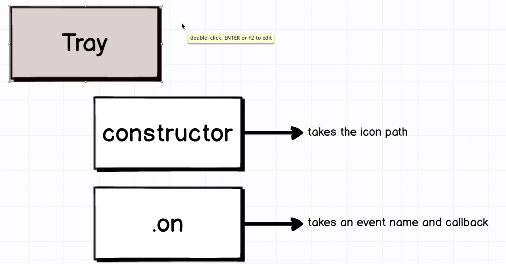

### Getting started

`npm install`

Start dev server:

`npm start`

In a new terminal window:

`npm run electron`

## TimerTray Subclass



* `constructor` => Make sure to call the parent constructor with the icon path - Tray still needs to do its own initial setup

* `onClick` => Make sure the on click event handler gets set up here too!

1. Create `/app/timer_tray.js` class

```js
const electron = require('electron');

const { Tray } = electron;

class TimerTray extends Tray
{
    constructor(iconPath)
    {
        super(iconPath);
    }
}
module.exports = TimerTray;

```

// 60. Finishing TimerTray Refactor

```js
const electron = require('electron');

const { Tray } = electron;
const HALF_WINDOWS_SIZE = 2;

class TimerTray extends Tray
{
    constructor(iconPath, mainWindow)
    {
        super(iconPath);

        this.mainWindow = mainWindow;
        this.on('click', this.onClick.bind(this));
    }

    onClick(event, bounds)
    {
        // Click event bounds
        const { x, y } = bounds;

        // Windows height and wi
        const { width, height } = this.mainWindow.getBounds();
         
        if (this.mainWindow.isVisible())
        {
            this.mainWindow.hide();
        }
        else 
        {
            const yPosition = process.platform === 'darwin' ? y : y - height;
            this.mainWindow.setBounds({
                x: x - width / HALF_WINDOWS_SIZE,
                y: yPosition,
                height: height,
                width: width
            });
            this.mainWindow.show();
        }        
    }
}

module.exports = TimerTray;
```